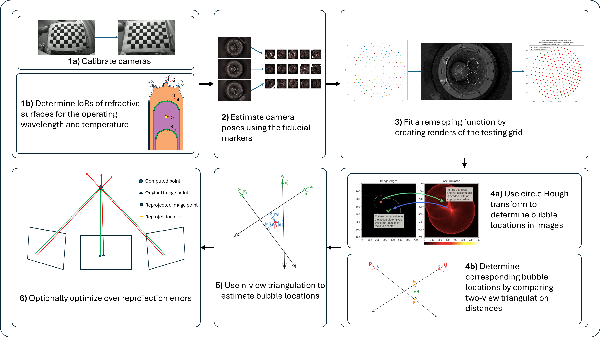

# Bubble Localization and Rendering for the SBC



This is the repository for the code associated with my thesis that can be found [here](thesis/Bubble_Localization_and_Rendering_for_the_SBC.pdf).

The primary files are [setup.py](setup.py) which contains functions for setting up and rendering images of the chambers, and [utils.py](utils.py) which contains several functions that are used for triangulation, remapping, creating plots, etc. Examples of how the functions from those files are used to create renders and triangulate bubbles can be found within the Jupyter notebooks.

The associated Blender files used to clean up and export the chamber model can be found [here](https://drive.google.com/drive/folders/1IG_XLitbM6101vEFMDmiwda3bSZK6OpN?usp=drive_link). If you wish to make edits to any of the chamber elements, you can do so in Blender and export the selected components to the `chamber_model/components/` folder. Make sure to make any corresponding necessary changes to the `setup.py` file!

## Setting Up the Environment
The code in this repository was run in an Anaconda environment. If you do not already have a version of Anaconda installed, I recommend downloading a minimal version of it [here](https://docs.anaconda.com/miniconda/) (or download a version with a full GUI from [here](https://www.anaconda.com/download/success)).

The easiest way to get the code up and running would be to create a new conda environment using the provided `environment.yml` file by navigating to this repository's directory in the Anaconda Prompt and running the following:

```
conda env create -f environment.yml
```

which will create a new conda environment named `Bubble` and automatically install all required packages with the versions used to create this code. If you want to install the environemnt under a different name, you can instead run (substituting `<env_name>` with your desired name):

```
conda create --name <env_name> --file requirements.txt
```

If you are using a code editor like VSCode, you should be able to open the Jupyter notebooks and run them using the newly created `Bubble` environment. 

If you instead want to run the code in the native Jupyter notebook environment, first activate the environment in an Anaconda Prompt:

```
conda activate Bubble
```

Then activate `Jupyter Lab` using the command

```
jupyter lab
```

which should open a lab environment where you can edit and run the notebooks using your default browswer.

---
Note that a `requirements.txt` file is also included in case you do not wish to use Anaconda (opting for something like Python's `virtualenv`) and should allow you to download all required packages using Python's package manager `pip`:

```
pip install -r requirements.txt
```
---

## Notebooks

- [`BasicRender.ipynb`](BasicRender.ipynb) Walks through the basics of setting up a Mitsuba scene of the chamber and creating a render.
- [`PixelRemappingAndTriangulation.ipynb`](PixelRemappingAndTriangulation.ipynb) Creates renders of the testing grid and uses those renders to determine the remapping functions and triangulations. This was the primary notebook used to test different remapping functions, triangulation methods, and optimization techniques.
- [`PixelRemappingAndTriangulation_Wrong_IoRs.ipynb`](PixelRemappingAndTriangulation_Wrong_IoRs.ipynb) A branch of the `PixelRemappingAndTriangulation.ipynb` notebook that creates renders of a smaller test grid to determine the effect that errors in the indices of refraction of chamber elements have on triangulation errors.
- [`PixelRemappingAndTriangulation_Multiple.ipynb`](PixelRemappingAndTriangulation_Multiple.ipynb) A branch of the `PixelRemappingAndTriangulation.ipynb` notebook that tests all of the available optimization methods simultaneously and plots their resulting loss curves and triangulation error histograms.
- [`PnP_Test_Chamber.ipynb`](PnP_Test_Chamber.ipynb) Determines the pose of camera 2 of the chamber using the pixel positions of the fiducial markers in a real image.
- [`PoseMatrixEstimation.ipynb`](PoseMatrixEstimation.ipynb) Estimates the pose of the cameras used for rendering by using estimated pixel positions of the fiducial markers within each camera's image. It also saves the resulting estimated pose matrices.
- [`TriangulationWithPixelLocalizationError.ipynb`](TriangulationWithPixelLocalizationError.ipynb) Plots the relationship between the average error in the pixel localization of bubbles vs the resulting error in triangulation.
- [`TriangulationWithPixelOffsetPnPPoses.ipynb`](TriangulationWithPixelOffsetPnPPoses.ipynb) Plots the relationship between the error in pixel localization of the fiducial markers vs the resulting error in the estimated pose and average triangulation error.
- [`TriangulationWithPnPEstimatedPoseMatrix.ipynb`](TriangulationWithPnPEstimatedPoseMatrix.ipynb) Runs n-view triangulation on the test grid using the estimated poses calculated in `PoseMatrixEstimation.ipynb`.
- [`CorrespondingBubbleDetectionTest.ipynb`](CorrespondingBubbleDetectionTest.ipynb) Features a test for a possible solution to determining corresponding bubble locations between images.

---

Note: notebooks located in the archive folder are not well documented and feature code that may be deprecated. They were mainly used in initial testing.

- [`archive\PnPEstimationWithCheckerboard.ipynb`](archive\PnPEstimationWithCheckerboard.ipynb) Tries to estimate the pose matrices of the cameras in the chamber by placing a checkerboard in the scene where the fiducial markers would normally be.
- [`archive\PnP_Test_Render.ipynb`](archive\PnP_Test_Render.ipynb) An earlier version of `archive\PnPEstimationWithCheckerboard.ipynb` that computed the pose for a single camera by placing the checkerboard in the scene where the fiducial markers would be.
- [`archive\CameraCalibrationWithRenderedCheckerboard.ipynb`](archive\CameraCalibrationWithRenderedCheckerboard.ipynb) Calibrated the camera used to render images by rendering a series of images of a checkerboard. Also features code that could be adapted to calibrate real cameras with real images.
- [`archive\LocationRemappingTest.ipynb`](archive\LocationRemappingTest.ipynb) Features some of the initial tests for determining the remapping coefficients of distortion functions.
- [`archive\LocationMappingComparedWithAndWithoutDistortedSurface.ipynb`](archive\LocationMappingComparedWithAndWithoutDistortedSurface.ipynb) Similar to `archive\LocationRemappingTest.ipynb`, performs initial tests for pixel remapping, now comparing the results with and without the distorted jar surfaces.
- [`archive\TwoCameraTriangulationError.ipynb`](archive\TwoCameraTriangulationError.ipynb) Initial triangulation tests for two-camera midpoint triangulation.
